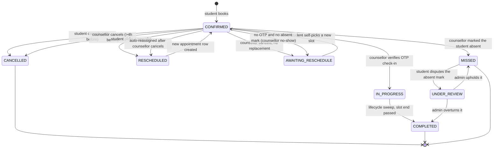

# Counselling - Cancellation and No-Show

Design spec for a counselling session that does not go ahead - cancelled by the student,
cancelled by the counsellor, or missed by either - including the automatic re-placement of
a student whose counsellor drops out.

> **Status:** Spec only. Nothing in this document has been built. Decisions below were
> settled in discussion; the "Open items" section lists what is still undecided or
> deliberately deferred.

---

## Table of contents

1. [Problem](#1-problem)
2. [Decisions](#2-decisions)
3. [Appointment status model](#3-appointment-status-model)
4. [What already exists](#4-what-already-exists)
5. [Student cancellation - the flow](#5-student-cancellation)
6. [Counsellor cancellation - the flow](#6-counsellor-cancellation)
7. [No-show - the flow](#7-no-show)
8. [Protecting the student](#8-protecting-the-student)
9. [Changes required](#9-changes-required)
10. [Emails and notifications](#10-emails-and-notifications)
11. [Edge cases and guards](#11-edge-cases-and-guards)
12. [Open items](#12-open-items)
13. [File inventory](#13-file-inventory)

---

<a name="1-problem"></a>
## 1. Problem

### Students cannot cancel at all

A student books a counselling session after finishing an assessment. If their plans change
there is currently **no way for them to cancel it**:

- No cancel control exists anywhere in the student portal.
- `PUT /counselling-appointment/cancel/{id}` is annotated with the
  `counselling.appointment.update` permission, which is seeded to the Counsellor role
  group. **That gate is nominal only** - see 4.2.
- The booking confirmation email offers no options at all - it ends with
  "Please be on time for your session."

Their only current escape is to reschedule once, or to phone someone.

### Counsellors can cancel, but the student is left stranded

A counsellor can cancel from their dashboard. When they do, the student receives an email
saying the session was cancelled and nothing else - no replacement, no link, no next step.
For a paid session that is the worst outcome in the system.

### A missed session always blames the student

The only presence signal in the system is **the counsellor verifying the student's OTP**.
The end-of-slot sweep reads it like this:

```java
boolean attended = a.getCheckinVerifiedAt() != null || "IN_PROGRESS".equals(a.getStatus());
```

No verification means `MISSED` and `attended = false` - on the **student's** record. So:

| What happened | Recorded as |
|---|---|
| Student did not attend | Student missed it - correct |
| **Counsellor** did not attend | **Student missed it** - wrong |
| Both attended, counsellor forgot the OTP | **Student missed it** - wrong |

Today that is only an inaccurate record. Once a missed session costs the student money
(decision 27), it becomes a charge for someone else's absence.

### Two defects in the existing `cancel()`

- **The freed slot dies permanently.** `cancel()` sets the slot to `CANCELLED`, and
  `SlotMaterializationService` explicitly skips `CANCELLED` slots. Nothing ever restores
  them. Every cancellation permanently destroys an hour of counsellor capacity.
- **No session is credited back.** The appointment carries an `entitlementId`, but
  `cancel()` ignores it. A cancelled session is silently lost.

---

<a name="2-decisions"></a>
## 2. Decisions

### 2.1 The allowance - shared by cancellations and no-shows

| # | Decision |
|---|---|
| 1 | The student gets **two misses**, counted across **cancellations and no-shows together**. Cancel once and no-show once and both are used. |
| 2 | Only **student-caused** events count. Anything caused by a counsellor or admin never does. |
| 3 | **Miss 1 credits the session back** - she rebooks free, with no deadline. |
| 4 | **Miss 2 does not credit back.** The next session must be **paid for** via Razorpay. Price is **set by the admin**, configured later - never hardcoded. |
| 5 | A **paid session carries a fresh allowance** - two misses again. She is not permanently in pay-per-session mode. |
| 6 | Nothing counts against her **until it is resolved**. An unresolved case never becomes a strike. |
| 7 | The remaining allowance is shown to her **in advance** - on the session card, at booking, and in every relevant email - never sprung at the moment of consequence. |

**Why one combined counter.** Two separate ladders would give four free misses and invite
gaming - cancel twice, then no-show twice. One counter is stricter, simpler to explain, and
matches how it feels to the counsellor on the other end: the session did not happen.

**Why "free once, then paid" rather than a flat block.** She has paid for counselling.
Hard-blocking after one miss means a genuine emergency costs her the whole session with no
recourse. Charging for the replacement keeps the door open while making repeat misses
expensive enough to discourage casual ones.

### 2.2 Student cancellation

| # | Decision |
|---|---|
| 8 | The student cancels from the **student portal dashboard** (My Counselling -> Upcoming -> session card). |
| 9 | Inside the cutoff the button is **greyed out and disabled, not hidden**, with an explanatory banner. |
| 10 | The cutoff is **2 hours** before session start, for **both cancel and reschedule**. |
| 11 | A cancelled session **stays visible** to her in the portal (Past tab, "Cancelled" badge). |
| 12 | Cancelling requires a **reason chosen from a dropdown**; "Other" requires free text. |
| 13 | The **counsellor can see the reason**. |
| 14 | Counsellor-name visibility stays exactly as it is today - **no changes** in either direction. |
| 15 | The freed slot returns to **`AVAILABLE`** and becomes bookable by anyone. |
| 16 | The counsellor is informed by **email + in-app notification**, and the session leaves their schedule. |

**Why 2 hours for both actions.** Cancel and reschedule reach the same end state. If the
cutoffs differ, the looser one becomes a loophole for the tighter one - a student blocked
from rescheduling at 3 hours out could cancel and rebook instead, achieving the same result
while bypassing the once-only reschedule cap.

### 2.3 Counsellor cancellation

| # | Decision |
|---|---|
| 17 | The counsellor cancels a **single session** from the appointments list in their portal. |
| 18 | Cancellation is allowed up to **4 hours** before the session starts. |
| 19 | Cancelling requires a **reason from a dropdown**. |
| 20 | The system tries to **auto-assign a replacement** - same time first, later the same day second. |
| 21 | Replacements come only from counsellors **assigned to that assessment**, offering the **same mode**, free and not on leave. |
| 22 | Where several are eligible, pick the one with the **lightest load that day**. |
| 23 | Shifts move **forward only** - never to an earlier time. |
| 24 | The cancelling counsellor's slot is **blocked**, never returned to `AVAILABLE`. |
| 25 | If no replacement exists, the appointment is **parked** and the student picks her own new slot. **Admin is notified.** |
| 26 | If the replacement counsellor also cancels **or declines**, no second auto-assignment - the student gets the self-reschedule email. |
| 27 | The **cancelling counsellor receives no notification** of the outcome. |
| 28 | The moved session appears in the cancelling counsellor's **Cancelled** list. |

**This does not replace the block-date / leave flow.** That stays as-is for planned
whole-day absence and still requires admin approval. The two coexist deliberately:

| | Block date (existing) | Single-session cancel (this spec) |
|---|---|---|
| Covers | A whole day | One appointment |
| Admin approval | Required | Not required |
| Replacement | None - student self-picks | Auto-assigned where possible |
| Trigger | Planned absence | Cannot take this session |

The existing block-date flow deliberately rejected auto-reassignment - see the comment at
`BlockDateRequestController:134-136`. That reasoning still holds for a whole day, where
every session would need moving at once. For a single session with a same-time replacement
available, auto-assignment is better, because nothing about the student's plans changes.

### 2.4 No-show

| # | Decision |
|---|---|
| 29 | Attendance is proven by the **counsellor verifying the student's OTP**. |
| 30 | The OTP stays **accepted for the whole session**. It is not locked to the first 10 minutes. |
| 31 | A **student no-show is marked by the counsellor**, using an explicit "student absent" action. |
| 32 | **If neither happens - no OTP and no absent mark - it is recorded as a counsellor no-show.** |
| 33 | At **10 minutes** with no check-in, both parties are prompted: the student to hand over her OTP, the counsellor to enter it or mark her absent. |
| 34 | The absent mark is available **only during the session itself** - from 10 minutes in until the slot ends. No grace period, never retroactively. |
| 35 | The student is **told immediately** when she is marked absent - with her remaining allowance, the link to rebook, and how to dispute it. |
| 36 | **Student no-show** -> counts as a miss; she gets the self-service reschedule link. |
| 37 | **Counsellor no-show** -> she loses nothing: session preserved, reschedule link sent, **admin notified that the counsellor missed it**. |
| 38 | Both the **counsellor portal** and the **admin counselling dashboard** show completed / no-show / cancelled figures - **split by whose fault**. |

**Why the default falls on the counsellor.** The counsellor holds both tools - verify the
OTP, or mark the student absent. Silence from the person who had the means to record
something means they were not there. This is what makes the outcome decidable without an
admin having to investigate every case, and it puts the burden on the party who can
discharge it with one click.

Consequence, accepted deliberately: if **neither** party attends, the counsellor takes the
no-show and the student walks away clean. She cannot be penalised on the strength of no
evidence at all.

**Why the OTP is not locked to 10 minutes.** Sessions start late. If the student joins at
minute 6 and the counsellor gets to the OTP at minute 11, a session that genuinely happened
would be recorded as a no-show and she would take a strike for attending. Keeping the OTP
open all session, and using 10 minutes purely as the prompt, gives the same detection
without punishing a real session.

**Why the absent mark is time-boxed and notified.** It is a one-click action with a
financial consequence for the student - a strike, and eventually a charge. A counsellor who
arrived late, or who has forgotten she was there, could clear the case with it and leave no
counter-evidence. Confining it to the session window and telling her the moment it happens
are the two cheapest guards available.

### 2.5 Admin cancellation

| # | Decision |
|---|---|
| 39 | Admin cancels a session from **Manage Students**. |
| 40 | An admin cancellation **costs nobody anything**. It is an operational decision, not anyone's fault. |
| 41 | The slot returns to **`AVAILABLE`** - the counsellor has not said they are unavailable. |
| 42 | **Both** the student and the counsellor are emailed: the session is cancelled and the team will be in touch. |
| 43 | No auto-reassignment and no self-reschedule link. The follow-up is human. |
| 44 | Every admin cancellation is **logged with the acting admin**. |

What "costs nobody anything" means concretely:

| | Effect |
|---|---|
| Student's allowance | Untouched. Not a miss. |
| Student's paid session | Preserved - credited back to the entitlement. |
| `studentRescheduleCount` | Not incremented. |
| Counsellor's record | No cancellation and no no-show recorded against them. |
| Slot | Back to `AVAILABLE`. |

Two contrasts worth noting, because the same `cancel()` method serves all three cases:

- **The counsellor is emailed here**, unlike counsellor self-cancellation where they are
  deliberately told nothing (decision 27). They did not initiate this one, so they need to
  know.
- **The slot reopens**, unlike counsellor cancellation where it is blocked. Nobody has
  declared themselves unavailable, so the hour should not be destroyed.

Logging matters: without `cancelled_by_role = ADMIN` recorded against a named admin, a
student could reset her allowance simply by phoning in each time.

### 2.6 Why the two cancellation windows differ

Students get **2 hours**, counsellors **4**. Between 4 and 2 hours before a session the
student can still cancel but the counsellor cannot. This is intended, not an inconsistency
to be tidied up later.

Four rather than ten for counsellors, because sessions run in business hours and a long
window is unreachable for most of the day:

| Session | Deadline at 10h | Deadline at 4h |
|---|---|---|
| 9:00 AM | 11:00 PM prev. day | 5:00 AM |
| 11:00 AM | 1:00 AM | 7:00 AM |
| 1:00 PM | 3:00 AM | 9:00 AM |
| 3:00 PM | 5:00 AM | 11:00 AM |
| 5:00 PM | 7:00 AM | 1:00 PM |

At 10 hours, a counsellor who wakes up unwell can cancel nothing before mid-afternoon. The
alternative to cancelling is not "cancelling earlier" - it is **not showing up**, and the
student travels to an empty office. Four hours leaves only the earliest slot unreachable
while still giving useful notice.

Counsellor reliability is better addressed by **visibility** - the reason dropdown plus a
repeat-offender view for admin - than by a window people route around by going quiet.

4 hours is also the value already hardcoded today, so only the student path changes.

---

<a name="3-appointment-status-model"></a>
## 3. Appointment status model



Today's straight `CONFIRMED -> MISSED` transition is what blames the student for every
absence, including the counsellor's. It is replaced by two distinct transitions, decided by
what the counsellor did rather than by silence.

`UNDER_REVIEW` exists **only for disputes**. The normal path never touches it - the outcome
is deterministic, so no admin has to arbitrate an ordinary session.

`CANCELLED` and `MISSED` are terminal for that row. Rebooking creates a **new** appointment;
it is not a state transition on the old one.

**Consequence:** any counter stored on the appointment row resets when a student cancels and
rebooks. This is why the allowance must be derived per **entitlement**, not held in a column
on the appointment (see 9.1).

The corresponding **slot** transitions:

| Appointment outcome | Slot becomes | Why |
|---|---|---|
| Student cancels | `AVAILABLE` | Someone else can take the time |
| Counsellor cancels | `CANCELLED` + `isBlocked` | The counsellor is not there; it must not be resold |
| Rescheduled away | `AVAILABLE` | Already correct in `reschedule()` |
| Session ended or missed | `COMPLETED` | Already correct in the lifecycle sweep; the time is past either way |

Note the same `cancel()` method must branch on **who** is cancelling to get this right.

---

<a name="4-what-already-exists"></a>
## 4. What already exists

### 4.1 Already working

Worth knowing before estimating - several pieces need no work at all.

- **Rebooking is automatically re-offered.** `BookingService.findActiveAppointment` treats
  `CANCELLED` and `MISSED` as dead statuses, so the "book counselling" offer reappears on its
  own. No change needed - **provided** the entitlement was credited back, otherwise the
  student sees the offer and hits a wall of zero sessions.
- **The end-of-slot sweep exists.** `CounsellingLifecycleService.closeEndedSessions()` runs
  every 5 minutes and closes each ended session. Its verdict logic needs changing (9.2) but
  the job, the query and the scheduling are all there.
- **Reminder emails already stop.** Both reminder queries filter on `status = 'CONFIRMED'`.
- **The no-show notice already exists** - `notifyStudentNoShow`, sent by the sweep.
- **The OTP check-in mechanism exists** - `CheckinOtpService`, setting `checkinVerifiedAt`
  and moving the appointment to `IN_PROGRESS`.
- **The counsellor's schedule already updates.** `CounsellorAppointmentsPage` excludes
  `CANCELLED` from the active list and already has a **Cancelled** tab with a count.
- **The counsellor is already notified on cancellation.** `cancel()` sends an email and
  writes an in-app notification whenever they are not the one cancelling. (The notification
  is written but currently has nowhere to be seen - see 9.5.)
- **The reason is already persisted.** `appointment_audit_log` has a dedicated `reason`
  column plus `performed_by`, `old_values`, `new_values` and a timestamp.
- **The disabled-button pattern already exists.** `UpcomingSessionCard` renders the
  Reschedule button disabled at 50% opacity with a tooltip and a yellow warning banner when
  the cutoff has passed. Cancel should reuse it verbatim.
- **The whole of the no-replacement path exists.** `AWAITING_RESCHEDULE`,
  `TokenProvider.createCounsellingRescheduleToken`, `LinkBuilder.counsellingReschedule`,
  `sendSelfRescheduleEmail`, and the in-app `APPOINTMENT_RESCHEDULE_NEEDED` nudge - all
  working today in the block-date flow. Both counsellor cancellation and counsellor no-show
  land here.
- **Blocking a vacated slot** - `CANCELLED` + `isBlocked = true`, exactly as
  `BlockDateRequestController:150-153` already does.
- **Counsellor pool resolution** - `BookingService:113-127`.
- **Re-pointing a counsellor after a reschedule** - `AdminCounsellingBookingService` already
  works around the trap described in 9.2.

### 4.2 Permission annotations are not enforced

`application.yml` sets `auth.enforce-mode: log-only` on **all three profiles**, and
production is deliberately held there (see the "REQUIRES USER ACTION BEFORE PRODUCTION
ENFORCE" block at the foot of the file). In `log-only`, `AuthorizationService` computes the
decision, records DENYs to `auth_audit`, and **always returns true**.

So every `@PreAuthorize("@auth.allows('counselling.appointment.update')")` on the counselling
controllers currently passes for any authenticated caller. Two consequences:

1. The existing `PUT /cancel/{id}` is not actually protected by that annotation today. It
   reads `userId` from the **request body** and performs no ownership check, so any
   authenticated user who can reach the route can cancel any appointment by id. This predates
   the present work but is worth raising separately.
2. **The ownership check specified in 9.2 must be explicit code in the controller or service
   body.** An annotation will not enforce it while `enforce-mode` is `log-only`, and this
   feature must not depend on a flag that production has not flipped.

### 4.3 The cutoff windows are computed against the wrong clock

No timezone is configured anywhere in the repo - no `TZ` env var, no
`spring.jackson.time-zone`, no `-Duser.timezone`, nothing in `Dockerfile.cron` or either
compose file. The JVM therefore takes the container default, which for a standard JDK base
image is **UTC**. All three datasource URLs also pin `serverTimezone=UTC`.

Slot times are stored as bare `LocalDate` + `LocalTime` with no zone, entered by counsellors
thinking in **IST**. The window check compares them directly against `LocalDateTime.now()`:

```java
LocalDateTime sessionTime = LocalDateTime.of(slot.getDate(), slot.getStartTime());
if (LocalDateTime.now().plusHours(CANCELLATION_WINDOW_HOURS).isAfter(sessionTime)) { ... }
```

With a UTC JVM and IST slot times those two are 5h30m apart, in the direction that
**under-restricts**. Worked example for a 3:00 PM IST session with a 2-hour window:

| Real moment (IST) | Server `now()` (UTC) | `now + 2h` | Blocks? | Should block? |
|---|---|---|---|---|
| 12:00 PM | 06:30 | 08:30 | no | no |
| 2:00 PM | 08:30 | 10:30 | no | **yes** |
| 4:00 PM (session over) | 10:30 | 12:30 | no | **yes** |
| 6:30 PM | 13:00 | 15:00 | yes | yes |

The server only starts refusing 3h30m **after** the session has already finished. The
browser, parsing the same times as local IST, computes the window correctly - so the button
greys out at the right moment and the only real defence is client-side, which is no defence
against a direct API call.

This is a **live defect in the existing 4-hour reschedule window**, not a new risk introduced
here. Every flow in this document inherits it. Resolved approach in 9.3.

---

<a name="5-student-cancellation"></a>
## 5. Student cancellation - the flow

### First miss

1. Student opens **My Counselling**. The upcoming session card shows the session details and
   a line reading *"You can cancel or reschedule until 1:00 PM on 12 Aug."*
2. She clicks **Cancel**. A confirm modal opens showing the session date/time, a **reason
   dropdown**, and her remaining allowance.
3. She picks a reason and confirms.
4. Server validates: ownership, status, and the 2-hour window.
5. On success:
   - appointment -> `CANCELLED`, tagged student-initiated, reason and timestamp stored
   - slot -> `AVAILABLE` (and `isBlocked = false`), bookable by anyone
   - the counselling session is **credited back** to the entitlement
   - she receives a cancellation confirmation email with a rebooking link and a cancellation
     calendar update
   - the parent/guardian receives the same email if one was supplied at booking
   - the counsellor receives an email (with the reason) and an in-app notification
6. The card moves to the **Past** tab marked Cancelled. **Book a Session** becomes available
   again, carrying the warning that the next miss will be chargeable.

### Second miss

Identical, except:

- the confirm modal warns that this is her last free miss and a new session must be paid for
- **no** credit-back occurs
- **Book a Session** routes her through payment rather than straight to slot selection

Because the counter is shared, "second miss" may mean her second cancellation, or a
cancellation following an earlier no-show. The wording must reflect what she has actually
used, not assume both were cancellations.

### Inside the 2-hour window

Both Cancel and Reschedule render **disabled at 50% opacity**, with a warning banner above
them:

> Cancellation closed - sessions cannot be cancelled within 2 hours of the start time.
> Contact support if you cannot attend.

The card already re-renders on a 30-second timer, so the state flips automatically as the
deadline passes.

### Reason dropdown

| Value | Label |
|---|---|
| `SCHEDULE_CLASH` | Schedule clash |
| `UNWELL` | Unwell |
| `DIFFERENT_TIME` | Need a different time |
| `NO_LONGER_NEEDED` | No longer need the session |
| `OTHER` | Other (free text required) |

Five options is deliberate. Longer lists push people to pick the first plausible entry, which
degrades the data.

---

<a name="6-counsellor-cancellation"></a>
## 6. Counsellor cancellation - the flow

The counsellor cancels one session from the appointments list in their portal, picks a
reason, and the system walks a three-rung ladder to re-place the student.

### Rung 1 - same time, different counsellor

An eligible counsellor is free at **the same slot time**. Assign the session to them.

Nothing about the student's plans changes. Since counsellor names are not shown to students,
this is close to invisible to her - the only things that actually change are the meeting link
(online) or the venue (offline), which is why she is emailed at all.

### Rung 2 - later the same day

No one is free at that time, but an eligible counsellor has a **later** slot on the same
date. Shift the session forward and email her the new time.

She can reschedule from that email if the new time does not suit - and doing so costs her
nothing (section 8).

### Rung 3 - nobody available

No eligible counsellor at any time that day.

- The appointment is parked as `AWAITING_RESCHEDULE`
- She is emailed a self-service reschedule link and picks any available slot herself
- **Admin is notified**, so the case is visible to a human

Rung 3 reuses the existing block-date machinery exactly, and is also where a **counsellor
no-show** lands (7.2).

> **Why park rather than cancel:** a parked appointment keeps its `entitlementId`, so the
> student's paid session stays attached and cannot be lost. Cancelling outright would require
> crediting the session back as a separate step, with a window where it belongs to nobody.
> Parking avoids the problem entirely.

### Who is eligible to take over

Counsellors are **not** interchangeable. A replacement must satisfy all of:

1. **Assigned to the student's assessment.** `BookingService:113-127` resolves the pool as
   counsellors assigned to the assessment, falling back to institute-mapped counsellors only
   when the assessment has none. Auto-assignment must use the same resolution, or a student
   ends up with a counsellor who does not handle their assessment type.
2. **Offering the same mode.** An online session must not silently become an in-person one,
   or the reverse. That is a far bigger change than a different address and is not something
   to spring on a student by email.
3. **Has a genuinely `AVAILABLE` slot** at the target time.
4. **No approved leave** for that date.
5. **No pending leave request** for that date - assigning to someone whose leave is likely to
   be approved risks moving the student twice.
6. **Active.**

Where more than one qualifies, choose the one with the **fewest appointments that day**.
Without an explicit rule the query order decides, which in practice means the same person
absorbs everything.

### Counsellor reason dropdown

Unwell - Personal emergency - Double-booked - Other.

Different list from the student's, same benefit: you find out why this is happening.

---

<a name="7-no-show"></a>
## 7. No-show - the flow

### 7.1 The two signals

**How check-in works.** The OTP is issued to the **student**. She reads it out to the
counsellor, who enters it. That relay is the whole point: only a student who is actually
present can supply the code, so a verified OTP is proof that **both** of them were there.
Entering it marks the session as happened and the student as present.

The counsellor therefore has exactly two actions available, and the outcome is decided by
which one they take:

| Counsellor action | Meaning |
|---|---|
| **Verifies the student's OTP** | Both present. Sets `checkinVerifiedAt`, appointment -> `IN_PROGRESS`. |
| **Marks "student absent"** | Student no-show. |
| **Neither** | Counsellor no-show. |

The OTP stays valid for the **whole session** - a late entry at minute 12 or minute 30 is
accepted normally and the session proceeds as usual. Ten minutes is a prompt, not a
deadline.

The absent mark is available **only from 10 minutes in until the slot ends**. Not before -
she deserves a few minutes' grace - and not afterwards, at all. The window is exactly the
session.

Consequence: a counsellor who leaves it until after the slot ends takes the no-show himself.
That is fair only because he was prompted at the 10-minute mark, well before the window
closes - which is why 7.2 is not optional.

### 7.2 The 10-minute prompt

A **new scheduled job** finds sessions that started 10 minutes ago with no check-in and
prompts both sides:

| To | Message |
|---|---|
| **Student** | Give your OTP to the counsellor so the session can be started. |
| **Counsellor** | Enter the student's OTP, or mark her absent - otherwise this is recorded as **your** no-show. |

The counsellor prompt matters as much as the student's. The default lands on them, and a
counsellor who is present but distracted would otherwise take a no-show for a session they
actually attended. One line of warning prevents most of the disputes this rule could
generate.

The existing sweep only acts at slot end, so this job is new. It is also a fourth
time-of-day comparison, so it must use the timezone helper from day one (9.3).

### 7.3 Outcomes

Decided by the rule, not by an admin. No investigation is needed for an ordinary session.

| What happened | Appointment | Entitlement | Counts against her? |
|---|---|---|---|
| OTP entered at any point | `IN_PROGRESS` -> `COMPLETED` | Consumed normally | No |
| Counsellor marked her absent | `MISSED` | Credited back if this is miss 1, not if miss 2 | **Yes** |
| Neither action taken | `AWAITING_RESCHEDULE` + self-reschedule link | Stays attached | No |

**Student absent** -> she is told **immediately**, not at slot end. The email branches on
what she has left:

- **Allowance remaining:** you were marked absent, you have one miss left, here is the link
  to book a new time.
- **Allowance used:** you were marked absent, this was your second miss, a new session will
  need to be paid for.

Either way she books the new time **herself, from the link**. The system never picks one for
her - it has no idea why she missed the first. Both variants carry the dispute route.

**Counsellor absent** -> identical landing to counsellor-cancellation rung 3. She loses
nothing, and **admin is notified that the counsellor missed the session** - a management
signal, separate from the student-facing handling.

### 7.4 Disputes

The absent mark is one click and it costs the student money, so she needs a way back.

Disputing moves the appointment to `UNDER_REVIEW` and **suspends the strike** until admin
resolves it - upheld (`MISSED` stands) or overturned (`COMPLETED`, nothing counted). If it
is never resolved, the default is **no strike**; an unresolved dispute is not evidence
against her.

This is the only path that reaches `UNDER_REVIEW`. Ordinary sessions never do.

### 7.5 What she sees

Both `AWAITING_RESCHEDULE` and `UNDER_REVIEW` need their own states on the Upcoming tab -
*"Awaiting your new time"* and *"Under review"* - for the same reason: they match neither
existing filter and would otherwise vanish from her dashboard entirely.

### 7.6 Reporting

Both the **counsellor portal** and the **admin counselling dashboard** show completed /
no-show / cancelled figures. These must be **split by fault**:

- sessions the **counsellor** missed vs sessions the **student** missed
- sessions the **counsellor** cancelled vs sessions the **student** cancelled

Merged into single numbers they are useless for management - a counsellor with many student
no-shows looks identical to one who keeps not turning up.

---

<a name="8-protecting-the-student"></a>
## 8. Protecting the student

When a counsellor cancels or fails to appear, none of it is the student's doing, so none of
it may cost her anything. Four guarantees:

**1. A forced shift does not consume her free reschedule.**
`AppointmentService.reschedule()` increments `studentRescheduleCount` unless the admin flag is
passed. Auto-reassignment **must** pass that flag. Otherwise every counsellor cancellation
silently burns the student's one reschedule.

**2. Cancelling because the new time does not suit does not count as a miss.** If her 3 PM
becomes 6 PM and she cannot do 6 PM, cancelling must not consume one of her two. Rule: a
cancellation on an appointment that was force-shifted is not counted.

**3. Her 2-hour window does not apply to a force-shifted session.** The window exists to
protect the counsellor's time from late student changes. It has no business locking her into
a time she never chose. She can reschedule from the emailed link regardless of how close the
session is.

**4. An unresolved or counsellor-caused no-show never counts.** Her allowance moves only on a
confirmed finding of her own absence.

> The emailed link is a token valid for **30 days**
> (`TokenProvider.createCounsellingRescheduleToken`). That covers "reschedule when you like"
> comfortably. An expired link should route her to the portal to book normally rather than
> simply failing - her session is still hers.

---

<a name="9-changes-required"></a>
## 9. Changes required

### 9.1 Database

Add to `counselling_appointment`:

| Column | Type | Purpose |
|---|---|---|
| `cancelled_by_role` | `VARCHAR(20)` | `STUDENT` / `COUNSELLOR` / `ADMIN`. Drives the allowance count, which tallies `STUDENT` only. |
| `cancelled_by_user_id` | `BIGINT` | Who performed it. Required for admin cancellations (decision 44); useful for the others. |
| `cancellation_reason` | `VARCHAR(50)` | Dropdown value. |
| `cancellation_note` | `TEXT` | Free text, required when reason is `OTHER`. |
| `cancelled_at` | `DATETIME` | When it happened. |
| `missed_by_role` | `VARCHAR(20)` | `STUDENT` or `COUNSELLOR`. Set by the rule in 7.3, not by an admin. |
| `marked_absent_at` | `DATETIME` | When the counsellor marked her absent. Also enforces the session-window limit on that action. |
| `marked_absent_by` | `BIGINT` | The counsellor who marked it - so a pattern is visible. |
| `dispute_raised_at` | `DATETIME` | Non-null means `UNDER_REVIEW` and the strike is suspended. |
| `dispute_resolved_at` | `DATETIME` | Null on a raised dispute means unresolved - and therefore no strike. |
| `dispute_resolved_by` | `BIGINT` | The resolving admin. |

`cancelled_by_role` and `missed_by_role` are the important ones. Without them there is no way
to tell the student's own miss from one a counsellor caused, and she would be penalised for
something she did not do.

**Counting the allowance:** count appointments on her entitlement where
`cancelled_by_role = 'STUDENT'` **or** (`missed_by_role = 'STUDENT'` **and** no unresolved or
upheld-against dispute). One query, both event types, disputed cases excluded until settled.

**On payment:** a paid session grants a fresh allowance. If the top-up creates a new
entitlement the count resets naturally; if it increments the existing one, the allowance needs
an explicit reset marker. Worth settling with open item 1.

> The same trap already affects `studentRescheduleCount`, which lives on the appointment row.
> Once students can cancel, cancel-and-rebook resets it to zero and the once-only reschedule
> cap stops binding. If that cap is meant to hold, it needs the same entitlement-scoped
> treatment.

### 9.2 Backend

**`AppointmentService`**

- `CANCELLATION_WINDOW_HOURS`: `4` -> `2` for the student path. The counsellor path keeps 4.
  Both belong in config, not as constants (open item 4).
- `cancel()`: **branch the slot handling on who is cancelling** - `AVAILABLE` +
  `isBlocked = false` for a student **or admin** cancellation, `CANCELLED` +
  `isBlocked = true` for a counsellor one. Only the counsellor case means the hour is
  genuinely gone.
- `cancel()`: persist `cancelled_by_role`, `cancellation_reason`, `cancellation_note`,
  `cancelled_at`.
- `cancel()`: credit the session back **only when this is her first miss**. Skip it on the
  second - that is what makes the next booking a paid one.
- New method to count a student's prior misses for an entitlement, per 9.1.

**`CounsellingLifecycleService`** - two changes, both material:

- The `attended` verdict must stop treating silence as the student's fault. At slot end the
  three-way rule from 7.3 applies: OTP verified -> `COMPLETED`; marked absent -> `MISSED`;
  **neither -> `AWAITING_RESCHEDULE` as a counsellor no-show**, not `MISSED`.
- Credit-back becomes **conditional**. Today it is unconditional, with a comment reading
  *"always rebookable, no forfeit."* Left as-is, she would always have a free session sitting
  there and the payment rule would never trigger.

**`CounsellorCancellationService`** - new. Given an appointment and the cancelling counsellor:

1. Enforce the 4-hour window, **using the timezone helper** (9.3).
2. Record `cancelled_by_role = COUNSELLOR` plus the reason.
3. Block the vacated slot.
4. Walk the resolution ladder in section 6.
5. Send the appropriate notifications (section 10).
6. Notify admin on rung 3.

**`CheckinReviewService`** - new. Three responsibilities:

1. A scheduled job that, 10 minutes after a session starts with no check-in, prompts **both**
   the student and the counsellor (7.2).
2. The counsellor's **"mark student absent"** action - permitted only inside the session
   window, writing `missed_by_role = STUDENT`, `marked_absent_at`, `marked_absent_by`, and
   notifying the student immediately.
3. The **dispute** path - raising it suspends the strike; admin upholds or overturns.

**Three traps in the re-placement itself**

- **The old counsellor comes along for the ride.** `AppointmentService.reschedule()` copies
  `oldAppointment.getCounsellor()` onto the new appointment. Built naively on top of it,
  auto-reassignment would move the session to counsellor B's slot while still recording
  counsellor A. Nothing looks wrong until someone checks. Re-point explicitly - the
  `AdminCounsellingBookingService` pattern already does this.
- **The venue snapshot goes stale.** The appointment stores `location` - the counsellor's
  office address, copied at booking so it stays stable. Reassign without re-taking it and the
  student travels to the wrong office. Re-snapshot from the new counsellor.
- **The meeting link is per-appointment.** Online sessions need the link regenerating; the old
  one must not be carried across.

**`CounsellingAppointmentController`**

- New **student-scoped** cancel endpoint. The existing `PUT /cancel/{id}` cannot be reused: it
  is annotated for `counselling.appointment.update` (a counsellor/admin permission) and takes
  `userId` from the **request body** with no ownership check.
- The new endpoint must load the appointment and assert
  `appointment.getStudent().getUserId()` matches the authenticated session user, rejecting
  otherwise. Do not trust a body-supplied `userId`.
- **This check must be written as explicit code in the method body, not as a `@PreAuthorize`
  annotation.** Per 4.2, `auth.enforce-mode` is `log-only` on every profile including
  production, so annotation-based gates always return true. An annotation here would look
  correct in review and enforce nothing at runtime.
- New counsellor cancel endpoint, an admin cancel endpoint (2.5), and a dispute-resolution
  endpoint.

**`BookingService`**

- Booking eligibility must reflect the allowance: two student-caused misses on an entitlement
  means the next booking requires payment.
- Expose eligible-counsellor resolution for re-placement.

### 9.3 Timezone handling

Decided approach, following 4.3. The system clock is **not** being changed - no `TZ` on the
containers, no server-wide setting. The offset is applied **in the counselling code only**,
scoped to what this project needs today. Multi-country is explicitly not being solved here.

**Config**

```yaml
app:
  counselling:
    timezone: Asia/Kolkata
```

Use the zone name rather than a literal 5h30m. Identical result for India (which has no
daylight saving), but it reads as "Indian time" instead of a bare number, and it is the only
form that would survive a second country later.

**One helper, not scattered arithmetic**

A single small component - `CounsellingClock` or similar - exposing `now()`, `today()` and
`timeNow()`, each reading the configured zone. Every counselling check calls it instead of
`LocalDateTime.now()` / `LocalDate.now()` / `LocalTime.now()` directly.

Three rules, each guarding a real failure mode:

1. **Only "now" is shifted. The stored slot time is never touched.** Slot times are already
   IST wall-clock and are correct as stored. Shifting them too produces a 5h30m error in the
   opposite direction.
2. **Date and time shift together.** Several checks read `LocalDate.now()` and
   `LocalTime.now()` on adjacent lines (e.g. `BookingService:184-185`). Shifting one and not
   the other yields yesterday's date with today's time between 00:00 and 05:30 IST.
3. **The offset is applied in exactly one place.** Written inline at each call site it will
   eventually be applied twice, or missed once.

**Scope for this build - four sites**

- `AppointmentService:228` - student cancel window
- `AppointmentService:353` - reschedule window
- the **new** counsellor 4-hour check
- the **new** 10-minute check-in alarm

The last two are easy to miss because they are new code rather than existing code being fixed.

**Follow-up, not blocking**

Ten further sites compare a time of day against now and carry the same 5h30m error today.
They are pre-existing, unreported, and out of scope here - but they should be migrated to the
helper once the pattern is proven:

`BookingService:185, 252, 288` (past-slot filtering) - `CounsellingLifecycleService:60`
(session-ended sweep) - `CounsellingRescheduleService:141` -
`AdminCounsellingBookingService:276, 312, 342` - `ReminderSchedulerService:107` (1-hour
reminder) - `SessionNotesService:82`

Note that `CounsellingLifecycleService:60` is being touched anyway for the `UNDER_REVIEW`
change, so it may as well be migrated at the same time.

**Deliberately left alone**

- **~20 date-only calls.** These ask only "what is today's date" to list slots. UTC and IST
  differ on the date only between 00:00 and 05:30 IST, when nobody is booking.
- **~7 self-consistent calls** - OTP expiry (`CheckinOtpService:72, 100, 113`), slot holds
  (`BookingService:295`, `CounsellingLifecycleService:122`), created-at stamps. These write
  `now + N` and later compare against `now` using the same clock, so both sides move together
  and the result is correct at any timezone. Changing them would be churn with no effect.

**Frontend: no change.** The browser already parses slot times as local, and students are in
India, so its calculation is correct today.

### 9.4 Student portal

**`UpcomingSessionCard.tsx`**

- Rename `RESCHEDULE_CUTOFF_MS` to a shared 2-hour constant used by both actions.
- Add a **Cancel** button beside Reschedule, using the existing disabled/opacity/tooltip
  treatment. Do **not** reuse `rescheduleCapReached` - the once-only cap is a reschedule
  concept.
- Add a permanent line showing the cancellation deadline, visible from booking onward.
- Add a permanent line showing the remaining allowance ("1 free miss remaining"), so the
  warning at cancel time confirms something already known rather than springing it.
- Confirm modal: session date/time, reason dropdown, allowance warning, confirm/dismiss.
- **"Awaiting your new time" state** for `AWAITING_RESCHEDULE`, with a pick-a-slot button.
- **"Under review" state** for `UNDER_REVIEW`.
- **A shifted session must explain itself**: "This session was moved from 3:00 PM because your
  counsellor was unavailable." Otherwise a silently changed time reads as a bug.
- Reschedule and cancel controls stay **enabled** on a force-shifted session regardless of the
  2-hour window.

**`StudentCounsellingPage.tsx`**

- The Past tab currently matches only `COMPLETED` or ended sessions, and Upcoming matches
  `CONFIRMED` / `IN_PROGRESS`. **`CANCELLED`, `MISSED`, `AWAITING_RESCHEDULE` and
  `UNDER_REVIEW` match neither**, so all four silently vanish from her dashboard. Add
  `CANCELLED` and `MISSED` to Past; `AWAITING_RESCHEDULE` and `UNDER_REVIEW` to Upcoming.
- The `AWAITING_RESCHEDULE` gap is **live today** in the block-date flow: her portal shows
  "No upcoming sessions - book a session to get started" while she has one parked.

**Book a Session page**

- Carry the allowance warning here too. This is the moment she commits to a time and the point
  where the warning actually changes behaviour.

**`AppointmentAPI.ts`** - add the student cancel call against the new endpoint.

**Error handling** - the client gate can disagree with the server at the boundary: she opens
the page at 2h05m, reads the modal, confirms at 1h58m, and the server correctly rejects. The
UI must surface that rejection ("Too late - cancellation closed while you were on this page")
and refresh the card, rather than showing a raw error or implying success.

### 9.5 Counsellor portal

- **Mount `NotificationBell` in the counsellor dashboard header.** The component exists and
  works, and `cancel()` already writes `APPOINTMENT_CANCELLED` notifications for counsellors -
  but the bell is mounted on exactly one page in the whole app (`StudentCounsellingPage`).
  Those notifications are currently written to the database and read by nobody. Cheapest item
  on this list.
- **Cancel button** on the appointments list, per session, plus the reason dropdown.
- Show the cancellation reason in the existing **Cancelled** tab.
- The cancelled session must appear in the **Cancelled** tab. Note that
  `CounsellorAppointmentsPage:107` excludes `COMPLETED`, `CANCELLED` and `DECLINED` from the
  active list but **not `RESCHEDULED`**, which is what the old row becomes when the session
  moves. Without handling, the moved session stays in their active list and today's count.
- **"Mark student absent"** action on the live session, available only inside the session
  window (7.1). Sitting alongside the existing OTP entry, since they are the two ways to
  close out a session.
- **Session outcome figures** - completed, no-show, cancelled - split by fault as per 7.6.
- No outcome notification to the cancelling counsellor (decision 27).

### 9.6 Admin

- Notification when counsellor-cancellation rung 3 is reached.
- Notification when a **counsellor** is recorded as the no-show party.
- A **dispute queue** - the only cases needing an admin decision - with uphold / overturn
  actions. Ordinary sessions resolve themselves, so this should stay small.
- Counselling dashboard: cancellations and no-shows with reasons, split by fault, plus the
  repeat-offender signal this feature generates - including a view over `marked_absent_by`,
  since a counsellor marking unusually many students absent is worth seeing.

---

<a name="10-emails-and-notifications"></a>
## 10. Emails and notifications

Recipients are the **student and the parent/guardian** where one was given at booking -
matching the confirmation email, and important for offline sessions where the parent may be
doing the travelling. `sendCancellationEmail` currently takes a single recipient, so the
parent who was told about the session never hears it was called off.

Build absolute links from **`app.frontend.url`**, which exists for exactly this purpose
("used to build absolute links emailed to users") and already resolves per profile:
`http://localhost:3000` in dev, `https://staging-dashboard.career-9.com` in sandbox,
`https://dashboard.career-9.com` in production. Do not hardcode a host.

### New: cancellation confirmation to the student

`cancel()` deliberately skips notifying whoever performed the cancellation - correct for the
counsellor-cancels case, wrong for a student cancelling her own session. She needs her own
email containing:

- confirmation that the session is cancelled, with the original date/time
- a direct link to rebook
- **how many misses remain**, in plain words
- a cancellation calendar update

### Counsellor-cancellation emails - three cases, not one

| Situation | Message |
|---|---|
| Rung 1 - same time | Session unchanged. New meeting link, or new venue for offline. |
| Rung 2 - shifted | New time, why it moved, and a link to change it if unsuitable. |
| Rung 3 - parked | Session on hold, pick a new slot, self-reschedule link. |

Rungs 1 and 2 need **separate templates**. "Your counsellor changed" barely affects her;
"your session moved to 6 PM" changes her day. One template will read wrong in one case.

### No-show messages

| When | To | Message |
|---|---|---|
| 10 minutes in, no check-in | Student | Give your OTP to the counsellor so the session can be started. |
| 10 minutes in, no check-in | Counsellor | Enter the OTP or mark her absent - **otherwise this is recorded as your no-show.** |
| Marked absent, allowance remaining | Student | Sent **immediately**: missed session, one miss left, **link to book a new time**, and how to dispute it if she was there. |
| Marked absent, allowance used | Student | Sent **immediately**: missed session, second miss, the next session must be paid for, and how to dispute it. |
| Counsellor no-show | Student | Session preserved, self-reschedule link, apology. |
| Counsellor no-show | Admin | The counsellor missed a session - management signal. |
| Dispute raised | Admin | Needs a decision; the strike is suspended meanwhile. |
| Admin cancelled the session | **Student and counsellor** | Session cancelled, the team will be in touch. No self-reschedule link - the follow-up is human. |

The counsellor prompt is not optional politeness - the default outcome lands on them, so a
counsellor who is present but distracted would take a no-show for a session they actually
attended. One line of warning prevents most disputes before they happen.

The existing `notifyStudentNoShow` covers only the third row, and it now carries a financial
consequence, so it needs the count and the dispute route added.

### Calendar invites must be withdrawn

Booking sends a real `.ics` invite plus an "Add to Google Calendar" link. If a session is
cancelled or moved and nothing is sent, the original event stays in the student's calendar
**and the counsellor's**, with a live meeting link, and both get an alarm for a session that
is not happening. On a shift she ends up with two entries and may attend the first.

Send an `.ics` with `METHOD:CANCEL` for the original event alongside any new one. `icsService`
already builds invites - this is a variant of existing code.

### Reminders

Reminder queries already filter on `CONFIRMED`, so a cancelled session stops reminding by
itself. A **moved** session must re-remind for the new time - a 24-hour reminder already sent
for the original time is stale the moment the session shifts.

### Existing emails to amend

| Email | Change |
|---|---|
| Cancellation (to counsellor) | Body says only "has been cancelled by [name]. If you have any questions, please contact us." The reason is passed in and then discarded. Include it. |
| Booking confirmation (to student) | Add a **"Manage your session"** link to the portal, and state the cancellation deadline. It currently ends at "Please be on time for your session" with no link anywhere. |
| No-show notice (`notifyStudentNoShow`) | Add her remaining count, the rebooking link, and the route to dispute it. |

---

<a name="11-edge-cases-and-guards"></a>
## 11. Edge cases and guards

### Student cancellation

| Case | Handling |
|---|---|
| Cancel arrives inside the 2-hour window | Server rejects. UI shows the reason and refreshes the card. |
| Cancel on a session already `IN_PROGRESS` or `COMPLETED` | Rejected. The time-window check catches this incidentally (start time is in the past), but an explicit status guard is clearer and should be added. |
| Student cancels an appointment that is not theirs | Rejected by the ownership check on the new endpoint. |
| Freed slot rebooked by someone else, student regrets it | No undo. The confirm modal is the safeguard. |
| Slot was manually created rather than materialised | Cancel must clear `isBlocked` as well as setting `AVAILABLE`, or it returns in a half-dead state. `reschedule()` already does this. |
| Cancellation minutes after booking | Allowed, and counts. No grace period - a grace window is a second cutoff to reason about for very little gain. |
| Student holds two active appointments | Possible only across **two entitlements** - `findActiveAppointment` is scoped per entitlement. Rare but real; each cancels independently and allowances are per entitlement. |

### Counsellor cancellation

| Case | Handling |
|---|---|
| Replacement counsellor cancels or declines | Treated identically. No second auto-assignment - straight to rung 3. |
| Counsellor cancels inside 4 hours | Refused. Falls to the no-show path. |
| Counsellor cancels a session already in progress or completed | Refused. |
| Only an earlier slot is free | Not used. Forward only. |
| Only a different-mode counsellor is free | Not eligible. Falls to rung 3. |
| Eligible counsellor has a pending leave request | Skipped. |
| Counsellor wants to drop their whole day | Not this flow - block-date request. |
| Vacated slot | Blocked permanently. The counsellor is not available; it must not be resold. |

### Admin cancellation

| Case | Handling |
|---|---|
| Admin cancels for any reason | Nobody penalised. Slot back to `AVAILABLE`, session credited back, both parties emailed. |
| Admin cancels because the counsellor cannot work the slot | Still no penalty, but the slot should be blocked rather than reopened - otherwise it is immediately rebookable on a counsellor who is not there. |
| Student had already used both misses | An admin cancellation does not consume a third. Her position is unchanged. |
| Repeated admin cancellations for one student | Visible via `cancelled_by_user_id`, so a pattern of phoning in for a free reset is detectable. |

### No-show

| Case | Handling |
|---|---|
| OTP entered at minute 12, or minute 30 | Accepted. Session proceeds normally. No prompt outcome, no review. |
| Counsellor tries to mark her absent at minute 3 | Refused - too early. She gets until minute 10. |
| Counsellor tries to mark her absent after the slot ends | Refused - even by a minute. The window is exactly the session, and he was prompted at minute 10. It becomes **his** no-show. |
| Both attended, counsellor never entered the OTP | Recorded as a **counsellor** no-show. The prompt at 10 minutes is the warning that this will happen. |
| Neither party attended | Counsellor no-show. She is not penalised on the strength of no evidence. |
| She was there but was marked absent | She disputes. Strike suspended until admin decides. |
| Dispute never resolved | Default: **no strike**. |
| Counsellor no-show | Her session is preserved and she is never charged for it. |
| Student misses a session she had already been force-shifted into | Still hers to explain - but worth admin discretion, since she did not choose the time. |
| She misses her second session and later pays | The paid session carries a **fresh allowance** of two. |
| Slot on a missed session | `COMPLETED`. The time is past; there is nothing to reclaim. |

---

<a name="12-open-items"></a>
## 12. Open items

### 1. Paid rebooking - gateway decided, price deferred to admin

After the second miss the student buys a single counselling session through **Razorpay**, the
same gateway used everywhere else. `application.yml` already configures it on sandbox and
production - `key-id`, `key-secret`, `webhook-secret` and a per-profile `callback-base-url` -
so a live gateway with webhook confirmation exists and does not need building.

**The price is set by the admin and will be configured later.** It must therefore be a stored,
admin-editable value - not a constant in code and not a hardcoded amount in the checkout call.
Until a value is set, the paid path should refuse cleanly rather than charge zero or a guessed
default.

Assumed mechanism unless overridden: **entitlement top-up** - a paid flow that increments the
counselling session count on the student's existing entitlement, reusing the configured
Razorpay order and webhook path.

Two things to settle when the price is set:

- whether the top-up attaches to the existing entitlement (assumed) or is recorded as a
  separate one-off purchase
- how the **fresh allowance** is represented - a new entitlement resets the count naturally, a
  top-up on the existing one needs an explicit reset marker (9.1)

### 2. Timezone - resolved, now in scope

Originally logged as a risk, then confirmed as a real defect (4.3). **Now decided and moved
into the build** - see 9.3.

Summary: the system clock stays on UTC; the offset is applied in the counselling code via a
config-driven helper. Multi-country explicitly out of scope. Four sites required for this
build; ten further pre-existing sites logged as follow-up.

The alternative considered and rejected was setting `TZ=Asia/Kolkata` on the containers - one
line, no code, and it would have repaired the reminder and session-closing jobs at the same
time. Rejected in favour of keeping the system on UTC as a base for future multi-country work.

**Consequence to carry:** until the ten follow-up sites are migrated, the reminder emails and
parts of the session-closing sweep still run on the wrong clock. That is unchanged from
today's behaviour, not a regression introduced here.

### 3. Admin cancellation - specified; sequence it last

Fully decided (2.5) and no longer an open question. Noted here only for build order: it is the
smallest of the three flows and depends on nothing the others do not already establish - the
`cancelled_by_role` branch, the slot handling, and the notification fan-out are all shared. It
can safely be built after student and counsellor cancellation without rework.

One thing it deliberately does **not** get: a self-reschedule link. The follow-up is human by
design. If that turns out to generate too many "nobody called me" complaints, adding the link
later is a one-line change, since the machinery is already in place for the other flows.

The existing `PUT /cancel/{id}` route stays as it is either way - not extended, not exposed to
new callers. The admin path gets its own endpoint with its own semantics.

### 4. Windows and thresholds belong in config

Three numbers now: the student's 2 hours, the counsellor's 4, and the 10-minute check-in
alarm. None is knowable with confidence before real behaviour is observed. Put all three in
`application.yml` so they can be tuned without a deploy.

### 5. Admin's role in no-shows is now small - by design

An earlier draft had admin arbitrating every uncontacted session. The deterministic rule in
7.3 removed the need: outcomes are decided by what the counsellor did, so admin now sees only
**disputes** and **counsellor no-shows**. Both should be rare.

Nothing outstanding here - noted so the reduced scope is not mistaken for an omission.

### 6. Repeat counsellor no-shows should escalate

A counsellor missing sessions is more serious than one cancelling them with notice. Currently
specced only as a dashboard figure. Worth an explicit escalation later.

### 7. Counsellor daily digest - suggested, not scheduled

For a counsellor with a full calendar, a single morning summary ("2 sessions cancelled since
yesterday, here is your updated day") is more useful than individual emails. Not needed for v1.

---

<a name="13-file-inventory"></a>
## 13. File inventory

### Backend

| File | Change |
|---|---|
| `service/counselling/AppointmentService.java` | Student window -> 2h; branch slot handling on canceller; conditional credit-back; persist canceller/reason; allowance count |
| `service/counselling/CounsellingLifecycleService.java` | No check-in -> `UNDER_REVIEW`, not `MISSED`; credit-back becomes conditional |
| `service/counselling/CounsellorCancellationService.java` | **New.** 4h window, resolution ladder, slot blocking, notifications, admin alert |
| `service/counselling/CheckinReviewService.java` | **New.** 10-minute alarm job; admin resolution with the four outcomes |
| `controller/career9/counselling/CounsellingAppointmentController.java` | Student-scoped cancel endpoint with explicit ownership check; counsellor cancel endpoint; admin review-resolution endpoint |
| `service/counselling/BookingService.java` | Allowance affects booking eligibility; expose eligible-counsellor resolution |
| `service/counselling/CounsellingNotificationService.java` | Student cancellation email; rung 1/2/3 templates; no-show alarm and resolution messages; reason in counsellor email; parent recipient; calendar withdrawal; portal link in confirmation |
| `model/career9/counselling/CounsellingAppointment.java` | Nine new fields |
| `db/migration/` | New migration for those fields |
| `service/counselling/CounsellingClock.java` | **New.** `now()` / `today()` / `timeNow()` in the configured zone (9.3) |
| `resources/application.yml` | `app.counselling.timezone: Asia/Kolkata`; both cancellation windows; the check-in alarm threshold |

### Student portal (`react-social`)

| File | Change |
|---|---|
| `pages/Counselling/student/components/UpcomingSessionCard.tsx` | Cancel button, shared 2h constant, deadline line, allowance line, confirm modal, "Awaiting your new time" and "Under review" states, moved-session explanation, controls enabled when force-shifted |
| `pages/Counselling/student/StudentCounsellingPage.tsx` | `CANCELLED` + `MISSED` on Past; `AWAITING_RESCHEDULE` + `UNDER_REVIEW` on Upcoming |
| `pages/Counselling/student/SlotBookingPage.tsx` | Allowance warning before booking |
| `pages/Counselling/API/AppointmentAPI.ts` | Student cancel call |

### Counsellor portal (`react-social`)

| File | Change |
|---|---|
| `pages/CounsellorDashboard/CounsellorAppointmentsPage.tsx` | Mount `NotificationBell`; cancel button + reason dropdown; **"mark student absent"** action; reason in the Cancelled tab; handle `RESCHEDULED` in the tab filters; outcome figures split by fault |

### Admin (`react-social`)

| File | Change |
|---|---|
| `pages/Counselling/admin/CounsellingDashboardPage.tsx` | Dispute queue with uphold / overturn; cancellation and no-show figures split by fault; `marked_absent_by` pattern view |
| `pages/GroupStudent/StudentManagementPage.tsx` | **Cancel session** action per student (2.5) |

### Reused unchanged

`TokenProvider.createCounsellingRescheduleToken` - `LinkBuilder.counsellingReschedule` -
`sendSelfRescheduleEmail` - `IcsService` - `CheckinOtpService` - `AdminCounsellingBookingService`
(as the re-pointing pattern).

### Unchanged by design

- `BlockDateRequestController` - the leave flow is untouched
- `CounsellingAppointmentRepository` reminder queries - already filter on `CONFIRMED`
- Counsellor-name visibility - explicitly out of scope

---

## Verification checklist

### Student cancellation

- [ ] Cancel outside 2h: appointment `CANCELLED`, slot back to `AVAILABLE`, session credited
- [ ] The freed slot is genuinely bookable by another student
- [ ] Cancel inside 2h: button disabled, banner shown, API rejects a forged request
- [ ] The 2h window is correct against **Indian** wall-clock time, not the server's UTC clock -
      verify by attempting a cancel 1 hour before an afternoon session
- [ ] Student A cannot cancel student B's appointment via a crafted request, with
      `auth.enforce-mode` left at `log-only` (i.e. the check is real code, not an annotation)
- [ ] Cancelled session appears in the student's Past tab
- [ ] Student, parent and counsellor all receive the correct email; reason present in the counsellor's
- [ ] Calendar event is withdrawn from both calendars
- [ ] Counsellor sees the in-app notification and the session leaves their schedule
- [ ] No reminder email is sent for a cancelled session

### Counsellor cancellation

- [ ] Cancel outside 4h with a same-time replacement available: student keeps her time, gets the new link or venue
- [ ] Cancel with no same-time replacement: session shifts forward, student emailed the new time
- [ ] Cancel with nobody available: appointment parked, self-reschedule email sent, **admin notified**
- [ ] Cancel inside 4h is refused
- [ ] The vacated slot is blocked and cannot be booked by anyone
- [ ] The reassigned appointment records the **new** counsellor, not the old one
- [ ] Offline reassignment updates the venue; online regenerates the meeting link
- [ ] A different-mode counsellor is never auto-assigned
- [ ] A counsellor with pending leave is never auto-assigned
- [ ] With several eligible, the lightest-loaded that day is chosen
- [ ] The moved session leaves the old counsellor's active list and appears under Cancelled
- [ ] A moved session re-sends its reminder for the new time
- [ ] The replacement counsellor declining goes straight to the self-reschedule email
- [ ] The 4-hour check is correct against Indian wall-clock time

### No-show

- [ ] OTP at minute 12, and at minute 30, are both accepted and the session completes normally
- [ ] No check-in at 10 minutes: **both** the student and the counsellor are prompted
- [ ] Counsellor marks her absent: `MISSED`, counts as a miss, she is notified **immediately**
- [ ] That email says one miss left + booking link when she has allowance, and "next one is paid" when she does not
- [ ] The absent mark is refused before minute 10, and refused once the slot has ended
- [ ] Neither action taken: recorded as a **counsellor** no-show, student parked with a link, **nothing counted**, admin told
- [ ] Neither party attends: still a counsellor no-show; the student takes no strike
- [ ] She disputes an absent mark: strike suspended, appointment `UNDER_REVIEW`
- [ ] Dispute upheld: `MISSED` stands. Overturned: `COMPLETED`, nothing counted
- [ ] Dispute never resolved: **no strike** applied
- [ ] `AWAITING_RESCHEDULE` and `UNDER_REVIEW` sessions appear on the student's Upcoming tab
- [ ] `marked_absent_by` makes a pattern visible per counsellor
- [ ] The 10-minute prompt is correct against Indian wall-clock time

### Admin cancellation

- [ ] Admin can cancel a session from Manage Students
- [ ] Slot returns to `AVAILABLE` and is genuinely rebookable
- [ ] The session is credited back to the entitlement
- [ ] **Both** student and counsellor receive the "team will be in touch" email
- [ ] No self-reschedule link is sent
- [ ] The student's allowance is unchanged, including when she had already used both misses
- [ ] `studentRescheduleCount` is not incremented
- [ ] Nothing is recorded against the counsellor
- [ ] `cancelled_by_role = ADMIN` and `cancelled_by_user_id` identify who did it

### The shared allowance

- [ ] One cancellation plus one no-show consumes both misses
- [ ] Miss 1 credits the session back; miss 2 does not
- [ ] After two misses, booking is routed through payment
- [ ] A counsellor-initiated cancellation never consumes a miss
- [ ] A confirmed counsellor no-show never consumes a miss
- [ ] A forced shift does not increment `studentRescheduleCount`
- [ ] A student cancelling a force-shifted session does not lose a miss
- [ ] A force-shifted session can be rescheduled by the student inside her 2-hour window
- [ ] A paid session grants a fresh allowance of two
- [ ] The remaining count is visible on the card, at booking, and in the relevant emails
